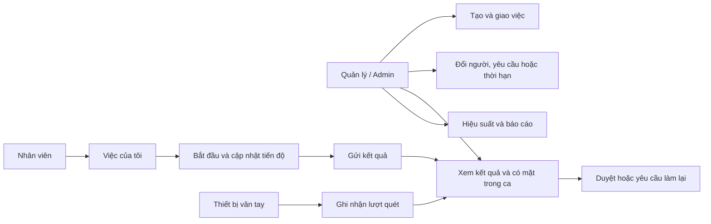
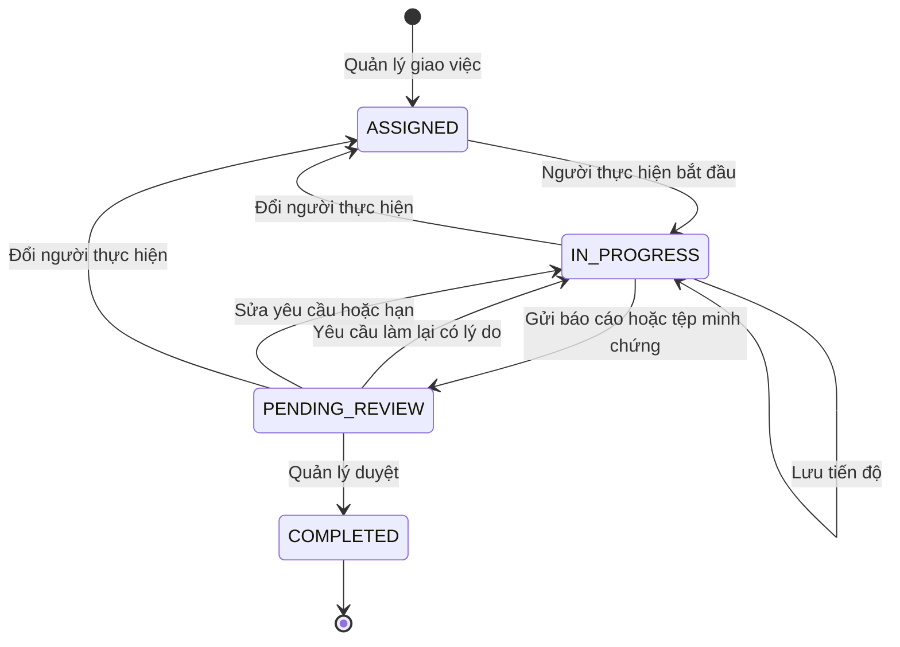
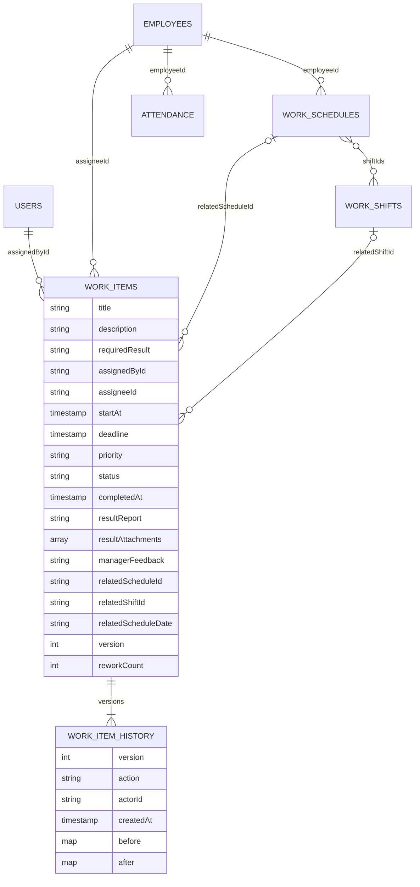

# Quản lý công việc kết hợp chấm công IoT

Cập nhật ngày 09/10/2026. Công việc có dữ liệu và vòng đời riêng. Vân tay chứng minh có mặt tại thiết bị; nội dung kết quả và bước duyệt của quản lý chứng minh hoàn thành công việc.

## Sử dụng

- Admin: **Công việc → Tạo và giao việc**. Nhập tên, mô tả, yêu cầu kết quả, người thực hiện, ngày/giờ bắt đầu, hạn, ưu tiên và ca tùy chọn. Ví dụ “Kiểm tra máy A”, hạn 16:00, yêu cầu biên bản kiểm tra.
- Giao theo ca: **Phân ca → Lịch → Giao công việc theo ca**. Chọn lịch của nhân viên, bấm **Giao công việc**, chọn đúng ca trong ngày nếu có nhiều ca.
- Nhân viên: **Việc của tôi → chi tiết → Bắt đầu thực hiện**. Mở lại chi tiết để nhập **Tiến độ và báo cáo kết quả**, bấm **Thêm ảnh** hoặc **Thêm tệp**, rồi chọn **Lưu tiến độ** hoặc **Gửi kết quả chờ duyệt**. Mỗi báo cáo tối đa 5 tệp, mỗi tệp tối đa 5 MB; có thể gửi kết quả bằng tệp mà không nhập văn bản. Tệp mới chọn chỉ được tải lên khi lưu hoặc gửi kết quả.
- Admin mở chi tiết việc chờ duyệt, đọc kết quả, bấm **Mở** cạnh tệp để xem bằng ứng dụng trên thiết bị, kiểm tra dữ liệu có mặt, rồi **Duyệt hoàn thành** hoặc **Yêu cầu làm lại** có lý do.
- **Tổng quan → Thông báo trong app** của Admin hiển thị 3 mục mới nhất, tiêu đề và nội dung ngắn. Chạm một mục để đọc đầy đủ, chọn **Xem thêm** để mở rộng danh sách. Thông báo phát cho nhiều người được gom theo cùng thông báo và nội dung, kèm số người nhận/chưa đọc.
- Danh sách hỗ trợ tìm tên/mô tả/người thực hiện, lọc trạng thái, ưu tiên, hạn hôm nay, trong 24 giờ, đang quá hạn và hoàn thành muộn.
- **Tổng quan/Trang chủ** hiển thị việc hôm nay, sắp đến hạn, quá hạn và chờ duyệt. Menu **Tác vụ** cũ đổi thành **Tiện ích**. Lương, đơn từ và chức năng nhân sự vẫn truy cập tại đây.
- **Tiện ích → Hiệu suất** xem các công việc có deadline trong tháng; chấm công/tăng ca hỗ trợ bật riêng.
- **Tiện ích → Báo cáo → Công việc** lọc theo ngày deadline, mã nhân viên/phòng ban rồi xuất CSV và mở trình chia sẻ Android. CSV giữ báo cáo, phản hồi, ca, phiên bản và thời điểm UTC ISO; không tự gửi cho người khác.

## Use Case





Quá hạn là thuộc tính tính từ deadline, không là trạng thái lưu. Việc chưa hoàn thành và deadline trước hiện tại là **Đang quá hạn**. Việc đã được duyệt có `completedAt > deadline` là **Hoàn thành muộn**; đúng bằng deadline là đúng hạn. Việc chờ quản lý duyệt vẫn chưa hoàn thành.

Đổi người xóa báo cáo, tệp đính kèm và phản hồi hiện hành cùng số lần làm lại của lần giao trước, đưa việc về Được giao; history giữ dữ liệu cũ. Số lần làm lại hiện tại dùng cho hiệu suất người đang nhận việc. Sửa việc chờ duyệt buộc nhân viên gửi lại kết quả. Việc đã duyệt khóa sửa để giữ kết quả và thời điểm duyệt.

## Dữ liệu và phân quyền



Collection `workItems`; history tại `workItems/{id}/history/{version}`. Mỗi lần tạo/cập nhật dùng transaction kiểm tra phiên bản và ghi history cùng lúc. Rules yêu cầu snapshot `before/after` khớp việc, người cập nhật khớp tài khoản, thời gian ghi/hoàn thành do server cung cấp; không được xóa việc hoặc sửa/xóa history. Nhân viên chỉ đọc việc hiện giao cho mình và cập nhật khi đang thực hiện; Admin giao/sửa/duyệt. Tài khoản/nhân viên đã ngừng hoạt động không được thực hiện nghiệp vụ.

Khi hai người cùng gửi phiên bản N, chỉ một thay đổi tạo N+1 thành công. Người còn lại được báo xung đột, giữ form và có thể xem thay đổi trước khi chọn phiên bản mới. Lịch/ca liên quan phải tồn tại, thuộc đúng người và ca nằm trong lịch; không dùng lượt quét để chuyển trạng thái công việc.

## Hiệu suất và IoT

Hiệu suất theo các việc có deadline trong tháng đã chọn, gồm việc bắt đầu ở tháng trước và được duyệt ở tháng sau. Tỷ lệ đúng hạn chỉ chia cho số việc đã hoàn thành; chưa có việc hoàn thành thì hiển thị chưa có tỷ lệ. Số việc làm lại và tổng số lần làm lại là hai số khác nhau. Thống kê hiện tại phản ánh người thực hiện và deadline hiện hành; thay đổi trước đây truy vết trong history.

Chi tiết việc có ca tải đủ dữ liệu đúng ngày/nhân viên và lọc đúng ca. Hỗ trợ bản ghi vân tay cũ chưa có nhãn ngày/ca và ca qua nửa đêm theo quy tắc phân giải hiện có. Dữ liệu thiếu, đang tải hoặc lỗi được hiển thị rõ. Quét vân tay không xác nhận chất lượng kết quả hoặc tự đánh dấu hoàn thành.

Thiết bị hiện chưa chọn mã công việc. Ghi nhận bắt đầu/kết thúc từng việc tại thiết bị và Kanban là hướng mở rộng. Kết quả hỗ trợ văn bản, đường dẫn và tệp minh chứng. Tệp nhỏ được lưu tại `workItems/{id}/attachments/{attachmentId}`, dữ liệu nhị phân chia thành các chunk 512 KiB trong subcollection `chunks`; metadata và toàn bộ chunk được ghi cùng một batch. Trường nhị phân `chunks.data` được miễn lập chỉ mục. Metadata/chunk bất biến, tham chiếu trong báo cáo phải khớp tệp đã lưu của đúng công việc và người thực hiện. Lịch sử giữ tệp đã gửi; người nhận việc mới không được mở tệp của người cũ. Tải lại kiểm tra quyền trên server, kích thước và SHA-256 trước khi mở bằng FileProvider. Listener công việc không cắt số lượng để tránh làm sai KPI; cần phân trang/thống kê server nếu mở rộng dữ liệu lớn.

## Triển khai và kiểm chứng

Build/cài APK mới và triển khai cấu hình Firebase mới trước khi dùng công việc online:

```powershell
.\gradlew.bat :app:testDebugUnitTest :app:assembleDebug
firebase deploy --only firestore:rules,firestore:indexes
node --test firmware/test/*.test.cjs
node --test firebase/functions/test/*.test.js
```

Rules Emulator cần Java 21; các test `firebase/test` dùng `FIRESTORE_EMULATOR_HOST`. Rules và miễn lập chỉ mục `chunks.data` đã được triển khai lên `chamcongiot-56ae5` ngày 09/10/2026; rules online đã được đọc lại và đối chiếu khớp bản kiểm thử. APK debug đã cài cập nhật trên điện thoại Redmi Note 8 đang kết nối. Kiểm tra UI hierarchy xác nhận danh sách thông báo thu gọn và nút xem thêm. Firmware phải biên dịch/nạp lại để nhận sửa queue. Functions resolver là đường chạy tùy chọn, chỉ áp dụng nơi Functions được triển khai.

Các kiểm thử bao gồm vòng đời, quyền, làm lại, giao lại, đổi hạn, hai người commit cùng phiên bản, lịch sử bất biến, ca liên quan, thời hạn và bộ lọc/CSV. Kiểm thử queue mô phỏng append bị dở, giới hạn dung lượng, đọc đuôi lỗi và backup cũ. Kiểm thử Functions giữ danh tính nhân viên của lượt quét khi mẫu vân tay được gán lại.

Kết quả ngày 09/10/2026 sau khi thêm tệp đính kèm và thu gọn thông báo: Android **329/329 kiểm thử, 52 bộ, không lỗi/bỏ qua**; Firestore Emulator **62/62**. Build APK debug thành công tại `app/build/outputs/apk/debug/app-debug.apk`; Android lint đạt, không lỗi (9 cảnh báo thư viện/icon hiện có). Kiểm thử đính kèm bao gồm tệp đúng giới hạn 5 MB với 10 chunk, metadata/chunk ghi nguyên tử, 5 tham chiếu, thay tệp, gửi chỉ có tệp, việc gắn ca, duyệt/làm lại/giao lại, dữ liệu cũ và từ chối người không có quyền. Helper Android kiểm tra stream thiếu/sai kích thước và tên tệp Unicode dài. Chưa xác minh trọn luồng tải lên/mở tệp bằng hai tài khoản trên điện thoại thật.

Các kiểm chứng firmware/Functions từ lần triển khai công việc trước: Functions **36/36**; firmware mô phỏng **79/79**. Firmware biên dịch thực tế thành công bằng Arduino CLI đã cài với `esp8266:esp8266:nodemcuv2`, core 3.1.2 (RAM 49%, IRAM 97%, flash 43%). Chưa nạp ESP8266.
